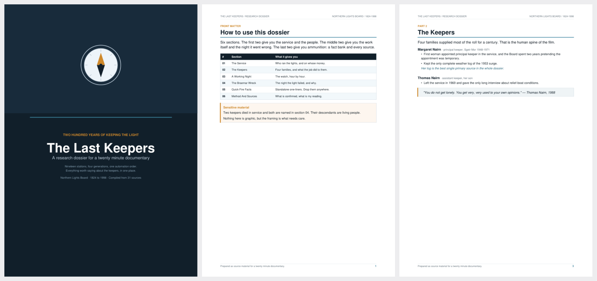
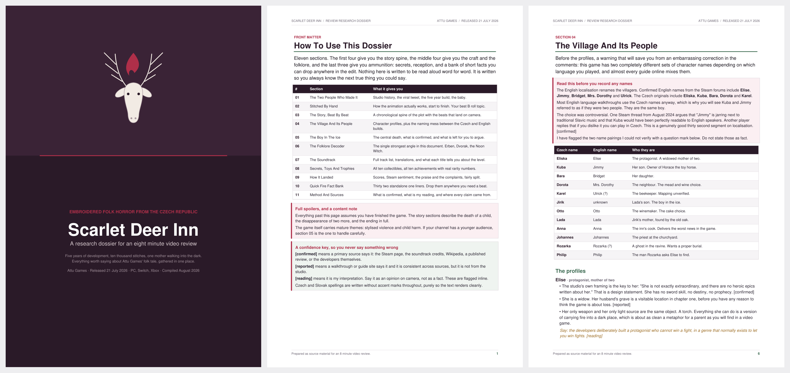
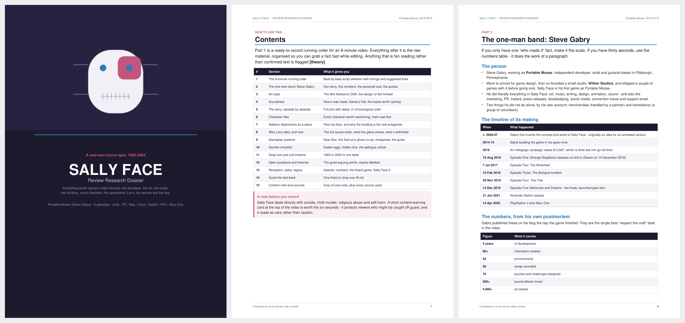
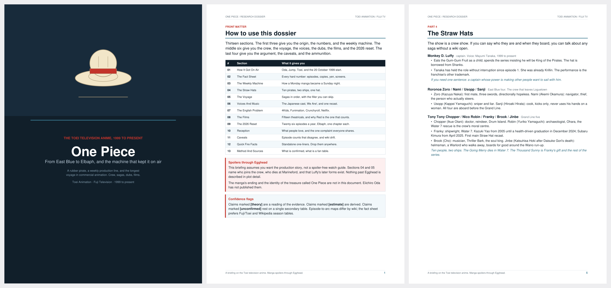
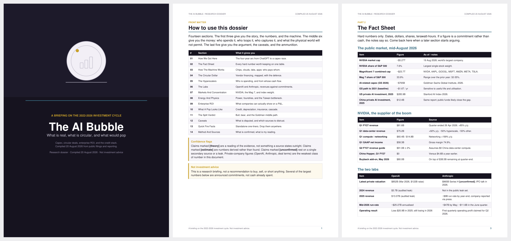

# Dossier PDF: an Agent Skill

Turn researched material into a PDF that looks commissioned: a dark cover whose
palette and geometric motif are derived from the subject, then dense editorial
body pages with themed tables, callout boxes and running furniture.

The style's one idea: **the palette and the motif come from the subject, not
from a fixed brand.** A folk-horror dossier is plum and crimson with a deer's
head. A clockpunk one is indigo and amber with a stopwatch. Same document, same
type scale, different soul.



## Examples

Four dossiers, four subjects. Every palette and every motif is pulled from the
subject itself. Click any image for full resolution.

### Using the skill on Claude Opus 5, from data I collected about the games

**Scarlet Deer Inn**, embroidered folk horror. Plum, moss and crimson, with an antlered head.



**Sally Face**, psychological horror. Indigo, blue and pink, with a stitched mask.



### Using Cursor on Grok 4.6, which handled the online research, the writing and the styling

**One Piece**, twenty six years of weekly animation. Navy and red, with a straw hat.



**The AI Bubble**, a briefing on the investment cycle. Near black and amber, with a chart.



## Install

### Simplest: just ask your agent

Paste this to Claude Code, Cursor, or any agent that can read a repo:

```
Install the dossier-pdf skill from
https://github.com/MegumiinUwU/Dossier-Design-Skill-Creating-Visually-Stunning-PDFs/tree/main/skills/dossier-pdf
```

### Claude Code

```bash
claude plugin marketplace add MegumiinUwU/Dossier-Design-Skill-Creating-Visually-Stunning-PDFs
```

```bash
claude plugin install dossier-pdf@dossier-design
```

`dossier-design` is the marketplace name, `dossier-pdf` the plugin. In an
interactive session, `/plugin` browses the same thing.

### Cursor

Add the repo from **Settings → Customize → Plugins**, or point Cursor at the
marketplace manifest at `.cursor-plugin/marketplace.json`. The skill is
discovered automatically from `skills/dossier-pdf/SKILL.md`.

### Skill upload (claude.ai, ChatGPT, and other hosts)

Download **`dossier-pdf.zip`** from
[Releases](https://github.com/MegumiinUwU/Dossier-Design-Skill-Creating-Visually-Stunning-PDFs/releases)
and upload it as a skill.

> Do **not** use GitHub's *Code → Download ZIP*. That nests everything under a
> `repo-name-main/` folder, and skill uploaders require `SKILL.md` at the zip
> root. The release asset is built for that shape by
> [`scripts/package_skill.py`](scripts/package_skill.py).

### Manual copy

```bash
cp -r skills/dossier-pdf ~/.claude/skills/     # personal
cp -r skills/dossier-pdf .claude/skills/       # project-scoped
```

### Dependencies

```bash
pip install reportlab        # required
pip install pymupdf          # optional: PNG previews and margin checks
```

Once installed, the skill triggers on requests like *"turn this research into a
dossier PDF"*, *"make me a briefing document"*, or *"give this PDF a proper
designed cover"*.

## What is in here

```
.claude-plugin/                   Claude Code plugin + marketplace manifests
.cursor-plugin/                   Cursor plugin + marketplace manifests
scripts/
  package_skill.py                validate every manifest, build the release zip
skills/dossier-pdf/
  SKILL.md                        the skill itself: workflow and non-negotiables
  references/
    theming.md                    turning a subject into a palette
    cover-motifs.md               the 21 bundled motifs, and writing your own
    api.md                        every method and argument
    style-spec.md                 every number, for hand-rolling or porting
    content-structure.md          what a dossier contains and how to write it
    troubleshooting.md            symptom-first fixes
  scripts/
    dossier.py                    the builder library
    motifs.py                     21 cover motifs
    preview_cover.py              render a cover, or a motif contact sheet
    new_dossier.py                scaffold a build script
    check_pdf.py                  verify before shipping
  assets/
    example_dossier.py            a complete, runnable document
```

## Releasing

```bash
python scripts/package_skill.py --version 1.1.0 --clean
```

Bumps the version in all four manifests, checks they agree, validates every
`SKILL.md` (frontmatter limits, body length, that linked reference files exist),
and writes `dist/dossier-pdf.zip` with `SKILL.md` at its root. Use
`--validate-only` in CI.

## License

MIT.
